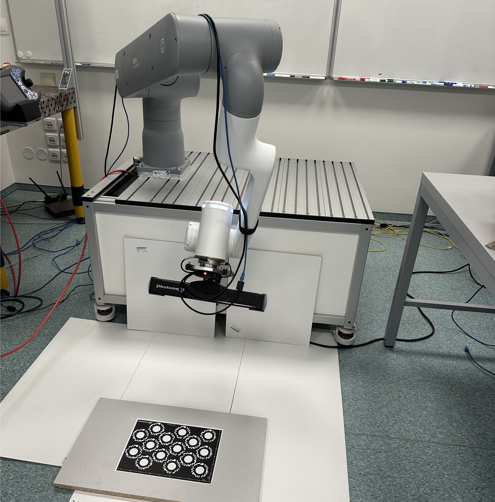

# Robotic application for technological prototyping

<p align="center">
  
</p>

## Requirements

**Software:**
```
Python 3.10, ROS2 Humble, Photoneo PhoXiControl 1.15.0, Tmux 3.2a
```

**Supported on the following operating systems:**
```
Ubuntu 22.04 (Jammy Jellyfish)
```

**Python Libraries:**
```
See the "Installation" section below
```

## Project Description

This project is focused on developing a robotic application that integrates a Photoneo 3D camera with a robotic arm to perform object detection and manipulation tasks. The application captures 3D images of objects, processes the data to identify and locate the objects, and then commands the robotic arm to pick and place the objects in designated locations. The system is designed to be modular and configurable, allowing for easy adjustments to camera settings and processing parameters, making it suitable for various research applications.

The integration is achieved by utilizing ROS2 Framework for communication between the camera and the robotic arm, ensuring modular data processing and robot ontrol. The application is structured to facilitate future enhancements, such as incorporating advanced image processing algorithms or expanding the range of objects that can be detected and manipulated.

## Installation

Before instalation, ensure that you have the required software installed on your system, including ROS2 Humble, Python 3.10, Photoneo PhoXiControl 1.15.0, and Tmux 3.2a.

1. **Clone the repository:**
   ```bash
   git clone https://github.com/Katzoun/master_project.git
   ```
2. **Navigate to the project directory:**
   ```bash
   cd ~/master_project
   ```
3. **Create Python virtual environments using the provided script:**
    
    This script will create necessary virtual environments in the `~/master_project/venvs` directory and install required python packages.
    ```bash
    bash scripts/init_enviroments.sh
    ```
4. **Build the project:**

    IMPORTANT: do not build using standard `colcon build` command. Use the custom build script instead:
    ```bash
    bash scripts/build.sh
    ```
